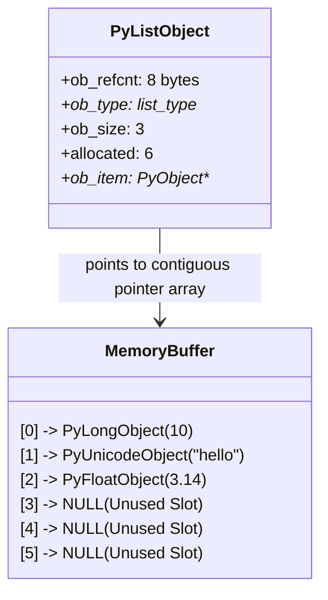

# 🐍 Python Lists: Architecture, CPython Internals & Algorithmic Guide

This document provides a university-textbook-depth study of Python's dynamic
array implementation: the **`list`**.

---

## 🏛️ 1. Theoretical Foundations & CPython Architecture

In Python, a `list` is **not** a linked list. It is an **externally dynamic,
contiguous array of pointers** to arbitrary Python objects (`PyObject*`).

### 1.1 CPython Internal Struct: `PyListObject`

In the CPython reference implementation (written in C), a list is represented by
`PyListObject`:

```c
typedef struct {
    PyObject_VAR_HEAD
    PyObject **ob_item;      // Pointer to an array of pointers to elements
    Py_ssize_t allocated;    // Total allocated slots in memory
} PyListObject;
```

#### Memory Architecture Breakdown:

- **`PyObject_VAR_HEAD`**:
    - `ob_refcnt` (8 bytes on 64-bit): Reference count for Python's garbage
      collector.
    - `ob_type` (8 bytes): Pointer to the `PyTypeObject` representing the `list`
      type.
    - `ob_size` (8 bytes): Number of logical elements currently contained in the
      list (`len(lst)`).
- **`ob_item`** (8 bytes): Pointer to a contiguous block of heap memory
  containing an array of 8-byte pointers (`PyObject*`).
- **`allocated`** (8 bytes): The total capacity (number of slots) allocated in
  `ob_item`.

### 1.2 Memory Layout Diagram



> [!NOTE] Unlike arrays in C or `numpy.ndarray`, Python lists do not store
> contiguous primitive values. They store contiguous 64-bit pointers to
> heap-allocated objects, enabling heterogeneous storage (e.g., ints, strings,
> custom objects in one list).

---

## 📈 2. Dynamic Resizing & Over-Allocation Formula

When appending items to a list whose logical size exceeds its allocated capacity
(`ob_size + 1 > allocated`), CPython reallocates the pointer array using an
over-allocation growth algorithm designed in `listobject.c`:

$$\text{allocated\_slots} = \text{new\_size} + (\text{new\_size} \gg 3) + (\text{if } \text{new\_size} < 9 \text{ then } 3 \text{ else } 6)$$

### 2.1 Capacity Growth Schedule

| Current Size | Added Item | New Length | Over-allocated Capacity | Unused Headroom Slots |
| :----------- | :--------- | :--------- | :---------------------- | :-------------------- |
| 0            | Append 1   | 1          | **4**                   | 3                     |
| 4            | Append 5   | 5          | **8**                   | 3                     |
| 8            | Append 9   | 9          | **16**                  | 7                     |
| 16           | Append 17  | 17         | **25**                  | 8                     |
| 25           | Append 26  | 26         | **35**                  | 9                     |
| 35           | Append 36  | 36         | **46**                  | 10                    |
| 46           | Append 47  | 47         | **58**                  | 11                    |
| 58           | Append 59  | 59         | **72**                  | 13                    |

### 2.2 Proof of Amortized $O(1)$ Time Complexity

Although resizing requires allocating a new memory block and copying $N$
pointers ($O(N)$ operation), reallocations occur exponentially less frequently
as $N$ grows:

- Over $N$ sequential append operations, the total number of copied pointers is:
  $$\sum_{k=0}^{\log_{1.125} N} N \cdot (0.888)^k \approx O(N)$$
- Dividing total work $O(N)$ by $N$ insertions yields **$O(1)$ amortized cost
  per append**.

---

## ⏱️ 3. Algorithmic Time & Space Complexity

| Operation               | Python Expression        | Best Case | Average Case       | Worst Case    | Space Complexity | Explanation                                                 |
| :---------------------- | :----------------------- | :-------- | :----------------- | :------------ | :--------------- | :---------------------------------------------------------- |
| **Index Access**        | `lst[i]`                 | $O(1)$    | $O(1)$             | $O(1)$        | $O(1)$           | Direct pointer arithmetic: `ob_item + i * 8`.               |
| **Index Assignment**    | `lst[i] = v`             | $O(1)$    | $O(1)$             | $O(1)$        | $O(1)$           | Replaces pointer and decrements old refcount.               |
| **Append to End**       | `lst.append(v)`          | $O(1)$    | $O(1)$ amortized   | $O(N)$        | $O(1)$           | Writes to `ob_item[ob_size]`; reallocates on full capacity. |
| **Pop from End**        | `lst.pop()`              | $O(1)$    | $O(1)$             | $O(1)$        | $O(1)$           | Decrements `ob_size`.                                       |
| **Insert at Index $i$** | `lst.insert(i, v)`       | $O(1)$    | $O(N - i)$         | $O(N)$        | $O(1)$           | Requires `memmove` to shift all trailing pointers right.    |
| **Pop at Index $i$**    | `lst.pop(i)`             | $O(1)$    | $O(N - i)$         | $O(N)$        | $O(1)$           | Requires `memmove` to shift trailing pointers left.         |
| **Search (by value)**   | `v in lst` / `.index(v)` | $O(1)$    | $O(N)$             | $O(N)$        | $O(1)$           | Linear scan invoking `__eq__` on each element.              |
| **Remove (by value)**   | `lst.remove(v)`          | $O(1)$    | $O(N)$             | $O(N)$        | $O(1)$           | Linear search $O(N)$ + pointer shift $O(N)$.                |
| **Slicing**             | `lst[a:b:k]`             | $O(1)$    | $O(\frac{b-a}{k})$ | $O(N)$        | $O(K)$           | Creates a new list and copies $K$ pointers.                 |
| **Sorting**             | `lst.sort()`             | $O(N)$    | $O(N \log N)$      | $O(N \log N)$ | $O(N)$           | Uses **Timsort** (adaptive merge sort / insertion sort).    |
| **Reverse**             | `lst.reverse()`          | $O(N)$    | $O(N)$             | $O(N)$        | $O(1)$           | In-place two-pointer swap of pointers.                      |
| **Clear**               | `lst.clear()`            | $O(1)$    | $O(N)$             | $O(N)$        | $O(1)$           | Decrements refcount of all items.                           |

---

## 🧮 4. Mathematical Indexing Algebra & Slicing Formalism

### 4.1 Index Normalization Function

Given a list $L$ of length $n = |L|$ and an integer index $i \in [-n, n-1]$:

$$\text{norm}(i, n) = \begin{cases} i & \text{if } i \ge 0 \\ n + i & \text{if } i < 0 \end{cases}$$

If $\text{norm}(i, n) < 0$ or $\text{norm}(i, n) \ge n$, Python raises an
`IndexError`.

### 4.2 Extended Slicing Algebra: `L[start:stop:step]`

For positive step $s > 0$:
$$k \in \{ \text{start} + j \cdot s \mid j \ge 0 \land \text{start} + j \cdot s < \text{stop} \}$$

For negative step $s < 0$:
$$k \in \{ \text{start} - j \cdot |s| \mid j \ge 0 \land \text{start} - j \cdot |s| > \text{stop} \}$$

---

## 🚀 5. Concrete CLI Walkthrough & Operations

The companion production module
[`src/data_structures/lists.py`](file:///C:/usr/src/ntua/chemeng/sandbox-python-pclab/src/data_structures/lists.py)
provides full CLI access to all operations.

### 5.1 Pattern Generation & Creation

```bash
# Generate 7 terms of Fibonacci sequence
uv run src/data_structures/lists.py create --pattern fibonacci --count 7
# Output: Created List: [0, 1, 1, 2, 3, 5, 8]

# Generate geometric powers of two
uv run src/data_structures/lists.py create --pattern powers_of_two --count 5
# Output: Created List: [1, 2, 4, 8, 16]
```

### 5.2 Extended Slicing & Negative Strides

```bash
# Slice elements with start, stop, and step
uv run src/data_structures/lists.py slice --elements 10,20,30,40,50,60 --start 1 --stop 5 --step 2
# Output: Sliced List: [20, 40]

# Reverse using negative step
uv run src/data_structures/lists.py slice --elements 1,2,3,4,5 --step -1
# Output: Sliced List: [5, 4, 3, 2, 1]
```

### 5.3 Positional Insertion & Deletion

```bash
# Insert element at specific index
uv run src/data_structures/lists.py insert --elements 10,30,40 --index 1 --value 20
# Output: Result List: [10, 20, 30, 40]

# Delete by index (pop)
uv run src/data_structures/lists.py delete --elements 10,20,30 --index 1
# Output: Result List: [10, 30] | Deleted Element(s): 20

# Remove all occurrences of a value
uv run src/data_structures/lists.py delete --elements 1,2,2,3,2,4 --value 2 --all
# Output: Result List: [1, 3, 4] | Deleted Element(s): [2, 2, 2]
```

### 5.4 Advanced Sorting Strategies (Timsort)

```bash
# Sort by string length
uv run src/data_structures/lists.py sort --elements "banana,fig,apple,elderberry" --key length
# Output: Sorted List: ['fig', 'apple', 'banana', 'elderberry']

# Sort by absolute numeric magnitude in descending order
uv run src/data_structures/lists.py sort --elements "-10,3,-2,8,1" --key abs --reverse
# Output: Sorted List: [-10, 8, 3, -2, 1]
```

### 5.5 Comprehension Filtering & Transformations

```bash
# Filter evens and compute squares
uv run src/data_structures/lists.py filter --elements 1,2,3,4,5,6 --filter-strategy evens --transform-strategy square
# Output: Filtered & Transformed List: [4, 16, 36]
```

### 5.6 Cyclic Rotation & Batch Chunking

```bash
# Right cyclic shift by 2 places
uv run src/data_structures/lists.py rotate --elements 1,2,3,4,5 --shift 2
# Output: Rotated List: [4, 5, 1, 2, 3]

# Partition into batches of size 3
uv run src/data_structures/lists.py chunk --elements a,b,c,d,e,f,g,h --chunk-size 3
# Output: Chunked Batches: [['a', 'b', 'c'], ['d', 'e', 'f'], ['g', 'h']]
```

### 5.7 Summary Descriptive Statistics

```bash
uv run src/data_structures/lists.py stats --elements 10,25,30,45,90 --json
```

```json
{
    "count": 5,
    "sum": 200.0,
    "min": 10.0,
    "max": 90.0,
    "mean": 40.0,
    "median": 30.0,
    "variance": 962.5,
    "std_dev": 31.024
}
```

### 5.8 Dynamic Memory Growth Empirical Tracking

```bash
uv run src/data_structures/lists.py growth --max-elements 32
```

```text
Length   Size (Bytes)   Overallocated Slots  Bytes/Elem
--------------------------------------------------------
0        56             0                    0.0
1        88             4                    32.0
5        120            4                    12.8
9        184            8                    14.22
17       248            8                    11.29
26       328            10                   10.46
```

---

## ⚠️ 6. Common Pitfalls, Anti-Patterns & Engineering Fixes

### Pitfall 1: Mutable Default Arguments

```python
# ❌ ANTI-PATTERN: Default list is evaluated ONCE at function definition time
def append_item(item, storage=[]):
    storage.append(item)
    return storage

print(append_item(1))  # [1]
print(append_item(2))  # [1, 2] -- UNINTENDED SHARED MUTATION!

# ✅ CORRECT IDIOM: Use Sentinel None
def append_item(item, storage=None):
    if storage is None:
        storage = []
    storage.append(item)
    return storage
```

---

### Pitfall 2: Modifying a List While Iterating Over It

```python
# ❌ ANTI-PATTERN: Removing elements skips items due to index shift
numbers = [1, 2, 2, 3, 4]
for n in numbers:
    if n == 2:
        numbers.remove(n)
print(numbers)  # [1, 2, 3, 4] -- One '2' was skipped!

# ✅ CORRECT IDIOM: List Comprehension or Slice Copy
numbers = [n for n in numbers if n != 2]
# or: numbers[:] = [n for n in numbers if n != 2] (in-place slice update)
```

---

### Pitfall 3: Shallow Copy vs Deep Copy

```python
# ❌ ANTI-PATTERN: Nested lists share memory references
matrix = [[0] * 3] * 3
matrix[0][0] = 99
print(matrix)  # [[99, 0, 0], [99, 0, 0], [99, 0, 0]] -- All rows mutated!

# ✅ CORRECT IDIOM: List comprehension for independent inner lists
matrix = [[0] * 3 for _ in range(3)]
matrix[0][0] = 99
print(matrix)  # [[99, 0, 0], [0, 0, 0], [0, 0, 0]]
```

---

### Pitfall 4: Using `list` as a FIFO Queue

```python
# ❌ ANTI-PATTERN: pop(0) is O(N) because all remaining pointers must shift
queue = []
for i in range(100_000):
    queue.append(i)
while queue:
    item = queue.pop(0)  # O(N) per pop -> O(N^2) total execution time!

# ✅ CORRECT IDIOM: Use collections.deque (O(1) popleft)
from collections import deque
queue = deque()
for i in range(100_000):
    queue.append(i)
while queue:
    item = queue.popleft()  # O(1) per pop -> O(N) total execution time
```

---

## 📊 7. Summary Reference Cheat Sheet

| Feature / Method       | Syntax / Invocation                         | Time Complexity | Space Complexity | CLI Command Example                                  |
| :--------------------- | :------------------------------------------ | :-------------- | :--------------- | :--------------------------------------------------- |
| **Creation**           | `create_list(pattern="fibonacci", count=8)` | $O(N)$          | $O(N)$           | `lists.py create --pattern fibonacci --count 8`      |
| **Slicing**            | `slice_list(data, start, stop, step)`       | $O(K)$          | $O(K)$           | `lists.py slice --elements 1,2,3,4,5 --step -1`      |
| **Insert**             | `insert_element(data, index, value)`        | $O(N)$          | $O(N)$           | `lists.py insert --elements 1,3 --index 1 --value 2` |
| **Delete**             | `delete_element(data, index, value)`        | $O(N)$          | $O(N)$           | `lists.py delete --elements 1,2,3 --index 0`         |
| **Search**             | `search_element(data, value, return_all)`   | $O(N)$          | $O(M)$           | `lists.py search --elements a,b,a --value a --all`   |
| **Sort**               | `sort_list(data, reverse, key_strategy)`    | $O(N \log N)$   | $O(N)$           | `lists.py sort --elements banana,fig --key length`   |
| **Reverse**            | `reverse_list(data, in_place)`              | $O(N)$          | $O(1)$ / $O(N)$  | `lists.py reverse --elements 1,2,3 --in-place`       |
| **Filter & Transform** | `filter_and_transform(data, f, t)`          | $O(N)$          | $O(N)$           | `lists.py filter --elements 1,2,3 --filter evens`    |
| **Rotation**           | `rotate_list(data, shift)`                  | $O(N)$          | $O(N)$           | `lists.py rotate --elements 1,2,3,4,5 --shift 2`     |
| **Chunking**           | `chunk_list(data, chunk_size)`              | $O(N)$          | $O(N)$           | `lists.py chunk --elements a,b,c,d --chunk-size 2`   |
| **Flattening**         | `flatten_list(data, depth)`                 | $O(N)$          | $O(N)$           | `lists.py flatten --elements "[[1,2],[3]]"`          |
| **Deduplication**      | `deduplicate_list(data, preserve_order)`    | $O(N)$          | $O(N)$           | `lists.py deduplicate --elements 1,2,2,3`            |
| **Statistics**         | `calculate_statistics(data)`                | $O(N)$          | $O(1)$           | `lists.py stats --elements 10,20,30`                 |
| **Growth Diagnostics** | `analyze_memory_growth(max_elements)`       | $O(N)$          | $O(N)$           | `lists.py growth --max-elements 64`                  |
| **Benchmark**          | `benchmark_operations(size, iterations)`    | $O(N \cdot K)$  | $O(N)$           | `lists.py benchmark --size 10000`                    |
| **Interactive Demo**   | `run_interactive_showcase()`                | $O(1)$          | $O(1)$           | `lists.py demo`                                      |
