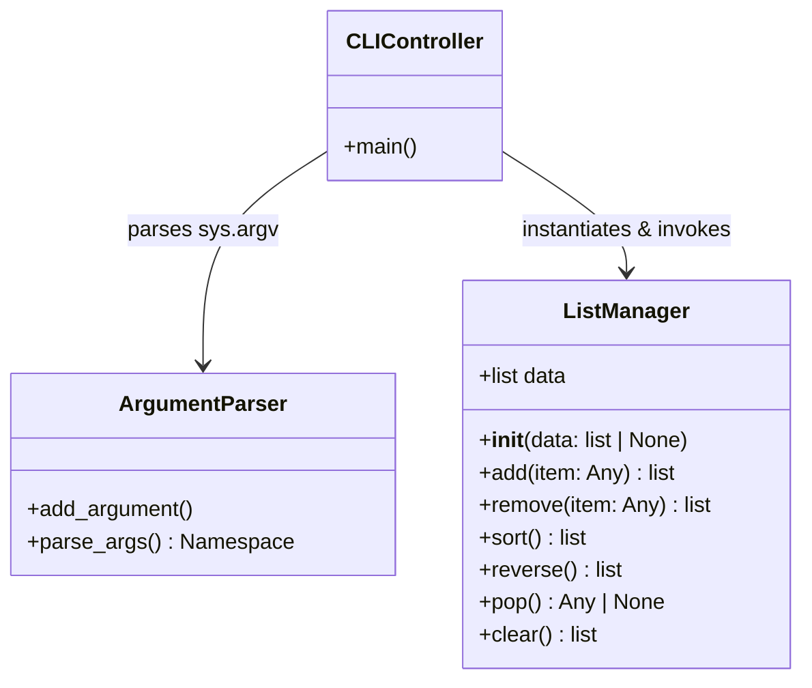
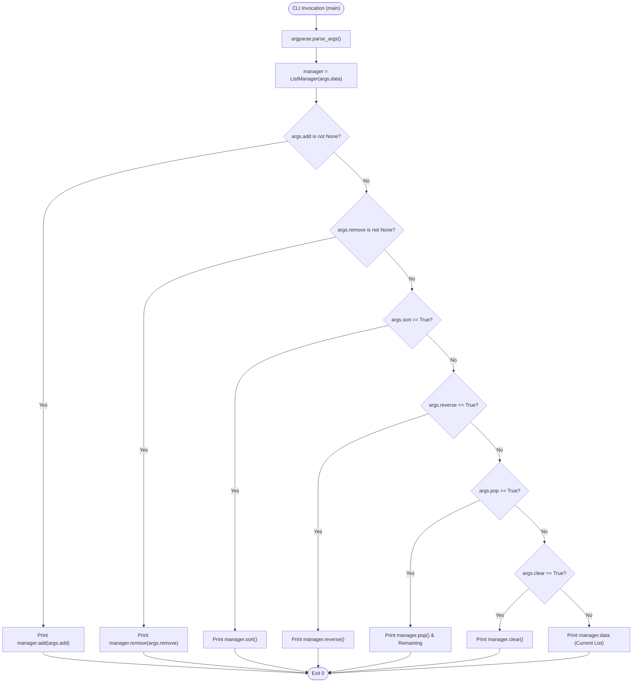

# 🎓 CS102: Data Structures & OOP — Python List Encapsulation & CLI Architecture

## Case Study: `example_list_001.py`

**Department of Informatics / Computer Science**  
**Course Module**: Algorithms, Memory Models & CLI Systems Architecture  
**Subject**: Object-Oriented Encapsulation of CPython Dynamic Arrays
(`PyListObject`)

---

## 🏛️ 1. Theoretical Foundations & Architectural Overview

The module
[`src/tutorial/list/example_list_001/example_list_001.py`](file:///C:/usr/src/ntua/chemeng/sandbox-python-pclab/src/tutorial/list/example_list_001/example_list_001.py)
implements an **Object-Oriented Encapsulation Layer** (`ListManager`) over
Python's native `list` data structure, combined with a **Command-Line Interface
(CLI)** dispatch system using Python's standard `argparse` library.

### 1.1 Structural Architecture & UML Model



---

## 🧠 2. Deep CPython Memory Model & Pointer Mechanics

In CPython, a `list` is not a linked list; it is a **contiguous array of
pointers** referencing heap-allocated `PyObject` structures.

### 2.1 CPython `PyListObject` Memory Layout

At the C-level (`Include/listobject.h` and `Objects/listobject.c`), the memory
layout is defined as:

```c
typedef struct {
    PyObject_VAR_HEAD
    PyObject **ob_item;      // Pointer to contiguous array of PyObject pointers
    Py_ssize_t allocated;    // Total capacity allocated in heap memory
} PyListObject;
```

```
+-------------------------------------------------------------+
|                      PyListObject                           |
+-------------------+--------------------+--------------------+
| ob_refcnt (8B)    | ob_type (8B)       | ob_size = 3 (8B)   |
+-------------------+--------------------+--------------------+
| allocated = 6 (8B)| ob_item (8B) ───┐                       |
+-------------------+-----------------│-----------------------+
                                      │
                                      ▼
             Contiguous Array of Pointers (Heap Buffer)
             +-----------+-----------+-----------+-----------+-----------+-----------+
    Index:   |    [0]    |    [1]    |    [2]    |    [3]    |    [4]    |    [5]    |
             +-----------+-----------+-----------+-----------+-----------+-----------+
    Address: | 0x7F...A0 | 0x7F...B8 | 0x7F...D0 |   NULL    |   NULL    |   NULL    |
             +-----------+-----------+-----------+-----------+-----------+-----------+
                   │           │           │       ▲ (Over-allocated Headroom)
                   ▼           ▼           ▼
             +----------+ +----------+ +----------+
             | "alpha"  | | "beta"   | | "gamma"  |
             +----------+ +----------+ +----------+
```

---

## ⏱️ 3. Method-by-Method Algorithmic & Complexity Analysis

Let $N = |\text{data}|$ denote the number of elements in `self.data`.

### 3.1 Method Complexity Matrix

| Method                                                                                                                                | Internal CPython Primitive        | Time Complexity (Best) | Time Complexity (Average) | Time Complexity (Worst) | Space Complexity | Mutation Type        |
| :------------------------------------------------------------------------------------------------------------------------------------ | :-------------------------------- | :--------------------- | :------------------------ | :---------------------- | :--------------- | :------------------- |
| [`__init__`](file:///C:/usr/src/ntua/chemeng/sandbox-python-pclab/src/tutorial/list/example_list_001/example_list_001.py#L5-L6)       | Assignment / Reference            | $O(1)$                 | $O(1)$                    | $O(1)$                  | $O(1)$           | Non-mutating         |
| [`add(item)`](file:///C:/usr/src/ntua/chemeng/sandbox-python-pclab/src/tutorial/list/example_list_001/example_list_001.py#L8-L10)     | `list.append(v)`                  | $O(1)$                 | $O(1)$ amortized          | $O(N)$                  | $O(1)$           | In-place mutation    |
| [`remove(item)`](file:///C:/usr/src/ntua/chemeng/sandbox-python-pclab/src/tutorial/list/example_list_001/example_list_001.py#L12-L15) | `item in self.data` + `remove`    | $O(1)$                 | $O(N)$                    | $O(N)$                  | $O(1)$           | In-place mutation    |
| [`sort()`](file:///C:/usr/src/ntua/chemeng/sandbox-python-pclab/src/tutorial/list/example_list_001/example_list_001.py#L17-L19)       | `list.sort()` (Timsort)           | $O(N)$                 | $O(N \log N)$             | $O(N \log N)$           | $O(N)$           | In-place permutation |
| [`reverse()`](file:///C:/usr/src/ntua/chemeng/sandbox-python-pclab/src/tutorial/list/example_list_001/example_list_001.py#L21-L23)    | `list.reverse()` (2-pointer swap) | $O(N)$                 | $O(N)$                    | $O(N)$                  | $O(1)$           | In-place permutation |
| [`pop()`](file:///C:/usr/src/ntua/chemeng/sandbox-python-pclab/src/tutorial/list/example_list_001/example_list_001.py#L25-L28)        | `list.pop()` (Tail removal)       | $O(1)$                 | $O(1)$                    | $O(1)$                  | $O(1)$           | In-place mutation    |
| [`clear()`](file:///C:/usr/src/ntua/chemeng/sandbox-python-pclab/src/tutorial/list/example_list_001/example_list_001.py#L30-L32)      | `list.clear()`                    | $O(1)$                 | $O(N)$                    | $O(N)$                  | $O(1)$           | In-place mutation    |

---

### 3.2 Pedagogical Code Dissection

#### 1. Sentinel Default Value Pattern (`__init__`)

```python
def __init__(self, data=None):
    self.data = data if data is not None else []
```

- **Informatics Principle**: Avoids Python's classic **Mutable Default Argument
  Trap**.
- In Python, default parameter expressions are evaluated **once at function
  definition time**, not at runtime invocation. Passing `data=[]` would share a
  single mutable list instance across all `ListManager` objects. Using `None` as
  a sentinel ensures each instance receives an isolated list.

#### 2. Safe Deletion Pattern (`remove`)

```python
def remove(self, item):
    if item in self.data:
        self.data.remove(item)
    return self.data
```

- **Informatics Principle**: Defensive exception prevention vs EAFP (_Easier to
  Ask for Forgiveness than Permission_).
- Native `list.remove(x)` raises `ValueError: list.remove(x): x not in list` if
  the item is absent.
- `ListManager.remove()` performs membership check `if item in self.data`
  ($O(N)$ linear scan), avoiding an unhandled runtime crash and returning the
  list unmodified.
- **Cost**: If `item` is present, it performs two $O(N)$ linear passes (one for
  `in` and one inside `remove()`).

#### 3. High-Performance LIFO Stack Pop (`pop`)

```python
def pop(self):
    if self.data:
        return self.data.pop()
    return None
```

- **Informatics Principle**: Boundary safety for Stack Data Structure (LIFO).
- Calling `.pop()` on an empty Python list raises
  `IndexError: pop from empty list`.
- By checking truthiness `if self.data`, the method guards against index
  exceptions and returns `None`.
- Time complexity is strictly $O(1)$ because popping from the array tail does
  not require shifting pointers in memory.

#### 4. Adaptive Timsort (`sort`)

```python
def sort(self):
    self.data.sort()
    return self.data
```

- **Informatics Principle**: CPython's sorting algorithm is **Timsort** (created
  by Tim Peters).
- Timsort is an adaptive, stable natural merge sort / insertion sort hybrid.
- **Best Case $O(N)$**: If the list is already sorted or reverse-sorted.
- **Worst Case $O(N \log N)$**: If the list is randomly ordered.

---

## 🎛️ 4. CLI Architecture & Dispatch Mechanics (`argparse`)

The `main()` function constructs a declarative argument specification:

```python
parser = argparse.ArgumentParser(description="Manipulate a list via CLI switches.")
parser.add_argument("--data", nargs='*', default=[], help="Initial list elements (e.g. --data a b c)")
parser.add_argument("--add", help="Add an item to the list")
parser.add_argument("--remove", help="Remove an item from the list")
parser.add_argument("--sort", action="store_true", help="Sort the list alphabetically")
parser.add_argument("--reverse", action="store_true", help="Reverse the list order")
parser.add_argument("--pop", action="store_true", help="Pop the last element")
parser.add_argument("--clear", action="store_true", help="Clear the list")
```

### 4.1 Dispatch Control Flow & Priority Ladder

The CLI handles execution through an `if-elif-else` sequential evaluation
ladder:



> [!IMPORTANT] **Evaluation Precedence**: Because the CLI uses an `if-elif-else`
> ladder, if multiple operation switches are passed simultaneously (e.g.
> `--add item --sort`), only the **highest-priority switch** in the ladder
> (`--add`) executes.

---

## 🔬 5. Type Narrowing & CLI String Coercion Caveat

When running via CLI:

```bash
python example_list_001.py --data 10 2 100 --sort
```

All CLI arguments parsed by `argparse` with `nargs='*'` default to **`str`
(strings)**:

- `args.data` becomes `['10', '2', '100']`.
- Lexicographical sort compares ASCII characters: `'10' < '100' < '2'`.
- Result: `['10', '100', '2']` (Lexicographical order, not numerical order).

To achieve numerical sorting, elements must be explicitly cast to `int` or
`float` before invoking `.sort()`.

---

## 📚 6. Pedagogical Summary

1. **Encapsulation**: `ListManager` wraps mutable list state and provides clean,
   exception-safe member functions.
2. **CPython Reality**: Lists are contiguous pointer arrays with $O(1)$ indexed
   access, $O(1)$ amortized append/pop, and $O(N)$ linear scans for
   search/removal.
3. **Defensive API Design**: Sentinel `None` defaults prevent cross-instance
   state leakage; safety guards prevent `IndexError` on empty pops.
